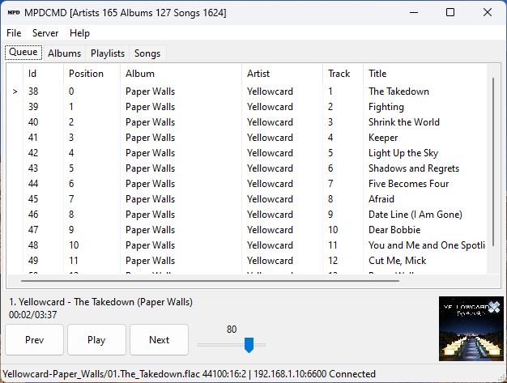

# MPD (Music Player Daemon) Client

Written in Python, wxPython

Optionally uses pynput to listen for media keys



## How to run on windows

### Create virtual environment

```python -m venv --upgrade-deps venv```

### Activate virtual environment

```venv/scripts/activate```

### Install requirements

```pip install -r requirements.txt```

### Run

```python .\mpdcmd\```

### Deactivate virtual environment

```deactivate```

## How to run on linux

### Create virtual environment

```python -m venv --upgrade-deps venv```

### Activate

```source venv/bin/activate```

### Install requirements

on debian bookworm ```apt-get install libgtk-3-dev``` is required for wxPython

```pip install -r requirements.txt```

### Run

```python ./mpdcmd/```
